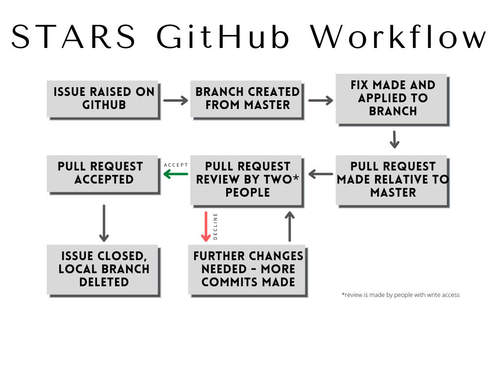

# Contributing

Welcome to contributing to the STARS code! Be sure to read this document thoroughly before contributing, as it outlines our policies for contributing to the code base.

## Creating Issues

Please always create a new GitHub issue for anything wrong with the code. Follow the following template:

```
Brief description of issue:

Steps to recreate:

modin / data files I am using:

Expected result:

Actual result:
```


## Workflow

