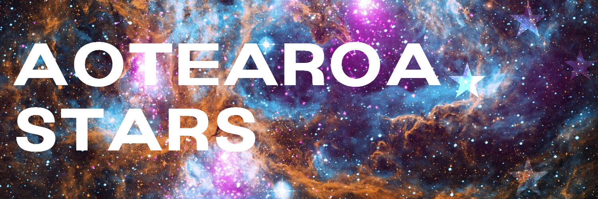

Aotearoa STARS
==============

Welcome to Aotearoa STARS!

This is the main repository for the *Aotearoa STARS Code* that is in use by Professor Jan Eldridge's Research Group, "Stars 'n' Supernovae".

It is a fork of the Cambridge STARS code originally written by Peter Eggleton, [original code here](https://people.ast.cam.ac.uk/~stars/#download).

# Documentation

I'm slowly cobbling together an operation manual [here](https://www.overleaf.com/read/qgtbhrgpwhqn)