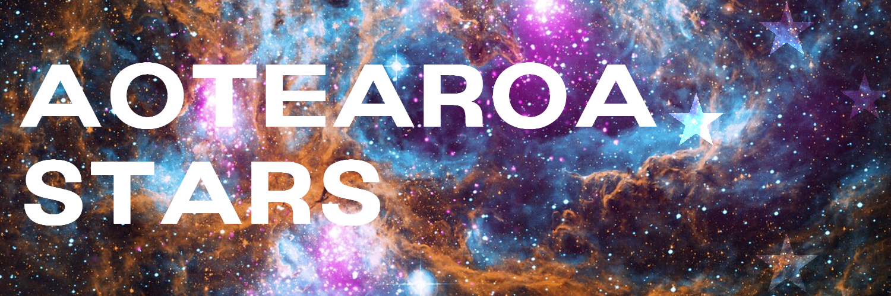

---

This is the repository for my fork of the *Aotearoa STARS Code* that is in use by Professor Jan Eldridge's research group, "Stars 'n' Supernovae". This repository contains the version of the code used during my PhD.

The *Aotearoa STARS Code* itself is a fork of the Cambridge STARS code originally written by Peter Eggleton, [original code here](https://people.ast.cam.ac.uk/~stars/#download).

# Documentation

Documentation is presently being written for this version. Until then, [the version most recently written by Warrick Ball](https://people.ast.cam.ac.uk/~stars/doc/stars.pdf) can be used, though it does not describe the changes made in particular for variable composition accretion.
